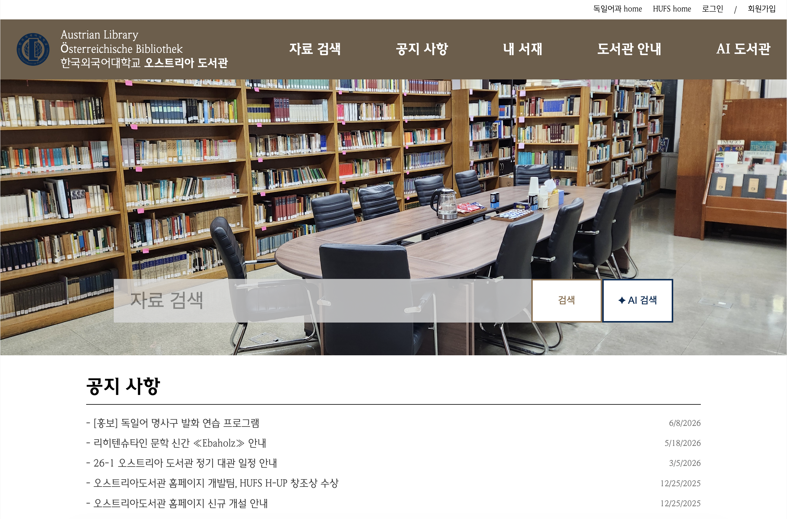
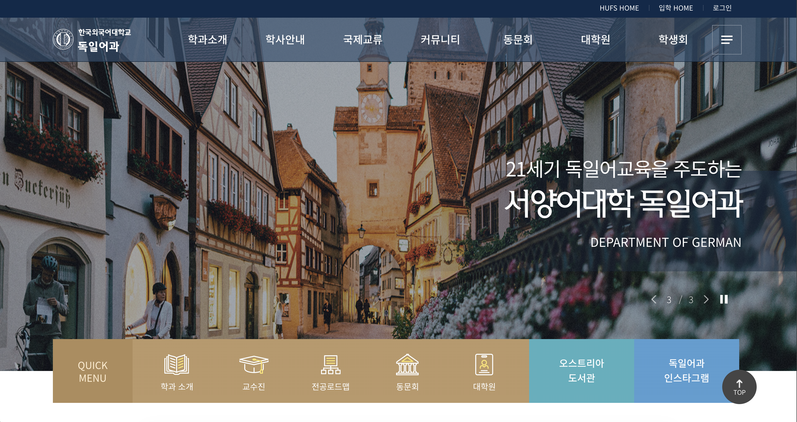

# Austrian Library HUFS

🌐 **Service**: [austrian-library-hufs.vercel.app](https://austrian-library-hufs.vercel.app/#/)



- A digitalization and AI integration project for the Austrian Library affiliated with the [Department of German](https://deutsch.hufs.ac.kr/deutsch/index.do), [Hankuk University of Foreign Studies (HUFS)](https://www.hufs.ac.kr/hufs/index.do).



- Conducted and managed by Jisoo Jang (HUFS, Department of German · Division of Language and AI) while serving as the library's student manager (*Gongno Scholarship Student*). (2025-2 - present)

- Tied to the following coursework and on-campus competitions:
  - 2025-2 HUFS H-UP Career Exploration Credit Program: full stack development (Excellence Award, team project with J.M.Park and S.C.Yang, supervised by Prof. Joonhyung Park)
  - 2025-2 Understanding Machine Learning: [book genre classifier](https://huggingface.co/spaces/jsjang0104/Book-Classifier) — [GitHub](https://github.com/jsjang0104/Works/tree/main/project/2025-2_book_classifier) (individual project, supervised by Prof. Seungtaek Choi)
  - 2026-1 Information Retrieval and Recommender System: (individual project, supervised by Prof. Seungtaek Choi)

## Structure
```
├── backend/        # Django REST API
├── frontend/       # Vue.js frontend
└── docs/
    ├── data/       # book data and DB update logs
    ├── dev/        # development records
    └── management/ # operation guidelines and reports
```
